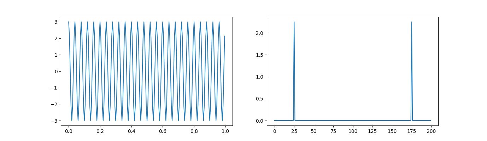
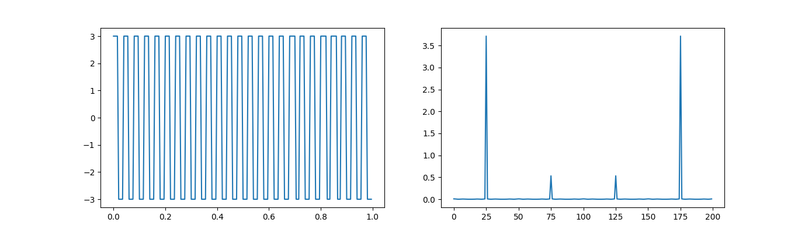
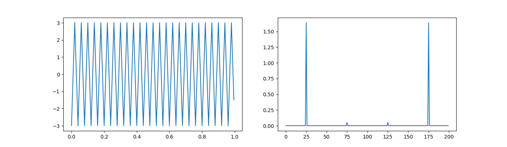
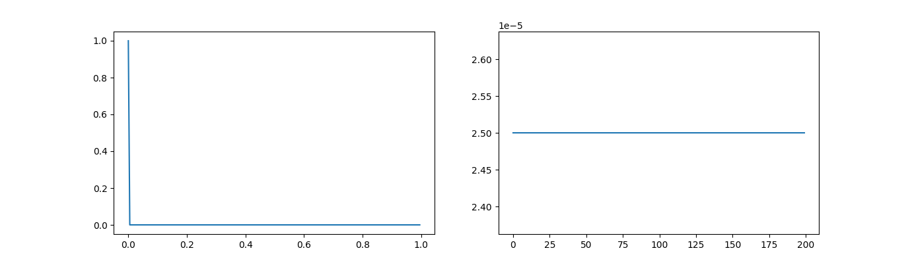

# 3 Simulaciones
Ejercicio del TP2, Temas relacionados con la DFT

## ejemplo 2.1 comentarios:
Grafique las siguientes señales lado a lado con su respectivo espectro en frecuencias:  
### 1) Senoidal. 
1) Frecuencia 25hz. B) Amplitud 3. C) Potencia promedio. D) Fs 200hz. E) N 200. 

### 2) Cuadrada. 
1) Frecuencia 25hz. B) Amplitud 3. C) Potencia promedio. D) Fs 200hz. E) N 200. 

### 3) Triangular 
1) Frecuencia 25hz. B) Amplitud 3. C) Potencia promedio. D) Fs 200hz. E) N 200. 

### 4) Delta en t=0. 
1) Frecuencia NA. B) Amplitud 3. C) Potencia promedio. D) Fs 200hz. E) N 200. 

Indicando en cada caso los siguientes parámetros (si corresponde) : 1) Frecuencia. B) Amplitud. C) Potencia promedio. D) Fs. E) N. 5) Pegue el link a un pdf con los códigos, gráficos y comentarios.

