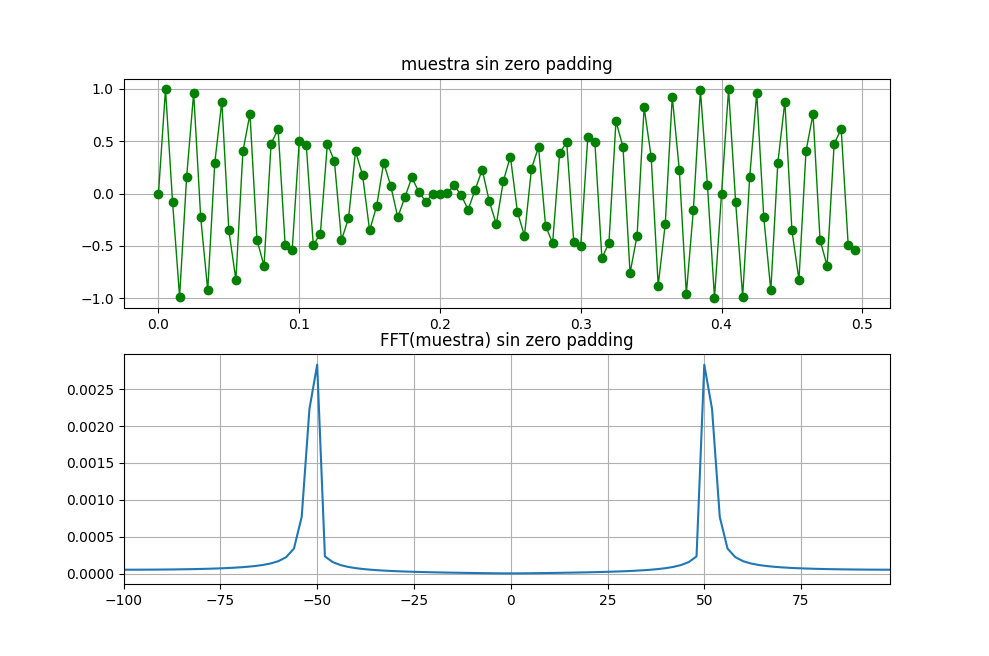
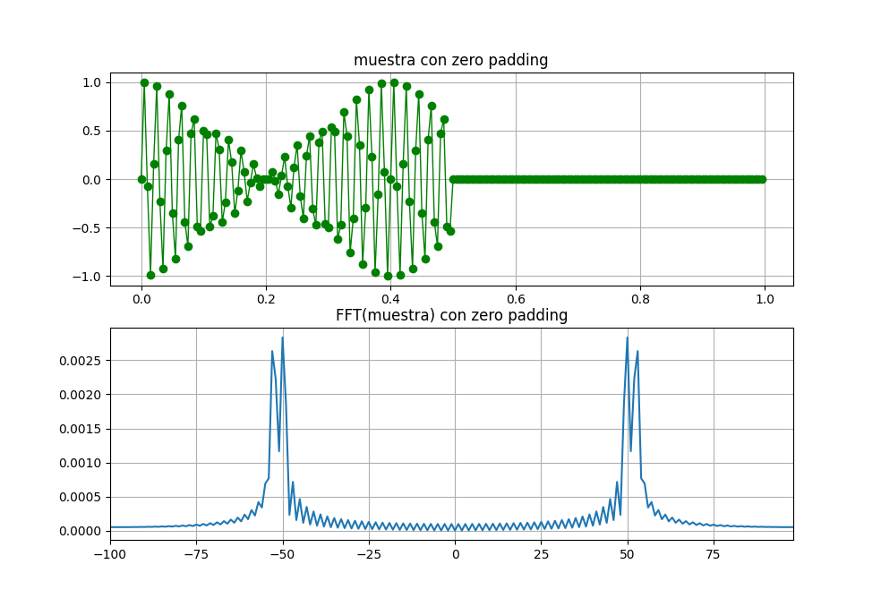

# 3 Simulaciones
Dado el archivo clases/tp2/resolucion_espectral.txt  que contiene 100 valores reales sampleados a Fs=200Hz, indique: 1) Resolución espectral. 2) Espectro en frecuencia de la señal. 3) A simple inspección que frecuencia(s) distingue. 4) Aplique alguna técnica que le permita mejorar la resolución espectral y tome nuevamente el espectro. 5) Indique si ahora los resultados difieren del punto 3 y argumente su respuesta. 6) Pegue el link a un pdf con los códigos, gráficos y comentarios.

### 1) Resolución espectral.. 
1) Resolución espectral 2.0 hz
### 2) Espectro en frecuencia de la señal. 

### 3) A simple inspección que frecuencia(s) distingue.
1) Se distingue la frecuencia de 50hz
### 4) Aplique alguna técnica que le permita mejorar la resolución espectral y tome nuevamente el espectro. 

### 5) Indique si ahora los resultados difieren del punto 3 y argumente su respuesta. 
Ahora se pueden distinguir dos frecuencia de amplitud que se pueden apreciar en el espectro que es la de 50hz y 53hz

